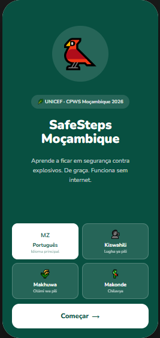

# 🌍 SafeSteps Mozambique

> **Explosive Risk Education (EORE) mobile app for children and communities in conflict-affected areas of Mozambique — built for UNICEF's Child Protection Work Stream.**

[](https://www.unicef.org)
[](https://flutter.dev)
[](https://offlinefirst.org)
[](#multilingual-support)
[](LICENSE)

---

<p align="center">
  
</p> 

## 📌 Overview

SafeSteps Mozambique is an **offline-first, multilingual mobile application** designed to teach children, families, and community members in northern Mozambique how to recognize, avoid, and respond to explosive hazards — including IEDs (Improvised Explosive Devices), ERW (Explosive Remnants of War), and UXO (Unexploded Ordnance).

The app was designed in response to a critical humanitarian need: **92% of explosive munition victims in Mozambique are children**. Since 2023, IED incidents have escalated sharply in conflict-affected districts like Macomia and Mocímboa da Praia, where communities are returning to heavily contaminated areas.

Built for UNICEF's **Child Protection Work Stream (CPWS)**, the app delivers age-appropriate, gender-sensitive EORE content adapted to Mozambique's cultural and linguistic context — with a design that prioritizes safety, warmth, and trust over military aesthetics.

---

## 🎯 Problem Statement

In conflict-affected northern Mozambique:

- Children represent **92% of explosive munition casualties**
- IED incidents rose from **1 in 2022 to 21 in 2023** (ACLED data)
- Displaced populations are **returning to contaminated areas** without awareness
- Humanitarian access is **limited and unpredictable**
- Many regions have **2G connectivity at best**, with frequent power outages
- Low digital literacy and interrupted schooling amplify children's exposure

There is an urgent need for educational tools that work **without internet**, in **local languages**, on **low-end Android devices**, and are designed to be safe and accessible for **children as young as 4 years old**.

---

## ✨ Key Features

### 🧒 Age-Adaptive Learning Modules

| Age Group | Approach |
|-----------|----------|
| 4–7 years | Illustrated characters, audio narration, mascot-guided lessons |
| 8–12 years | Interactive stories, tap-through quizzes, visual recognition cards |
| 13–17 years | Scenario-based challenges, incident reporting, peer sharing |

### 📡 Offline-First Architecture

The app is built **local-first**: all lessons, audio, quizzes, and user progress are stored on-device using SQLite. Internet connectivity is only needed for:
- Downloading content updates
- Syncing anonymized analytics to the UNICEF dashboard
- Receiving emergency alerts about new contaminated zones

The UI always shows offline status clearly and **never blocks learning due to lack of connectivity**.

### 🗣️ Multilingual Support

Content is available in:
- 🇧🇷 **Portuguese** (official)
- 🌍 **Kiswahili**
- 🏘️ **Makhuwa / Makuwa**
- 🏘️ **Makonde**

Language packs are modular — users download only the language and region they need, minimizing data usage.

### 🎮 Gamified Safety Learning

Children earn **"Safety Hero" badges** and progress through levels as they complete lessons and quizzes. A friendly local mascot (a Mozambican bird or animated capulana character) guides the experience — designed to feel like Khan Academy Kids or Duolingo, not a military manual.

### 🔔 Emergency Alert System

UNICEF field teams can push lightweight, high-priority alerts about new hazard areas — delivered even on weak connections using delta updates.

### 📊 Humanitarian Analytics Dashboard

A companion web panel for UNICEF/NGO teams shows:
- Lessons accessed by district
- Most-viewed content by age group
- Language usage
- Sync activity by region

All analytics are **fully anonymized** — no precise child locations, no personal identifiers.

---

## 🏗️ Architecture

```
┌─────────────────────────────────────────────────────────┐
│                  MOBILE APP (Flutter)                   │
│                                                         │
│  ┌──────────────┐  ┌──────────────┐  ┌──────────────┐  │
│  │  Edu Modules │  │  Quiz Engine │  │  Alert Feed  │  │
│  └──────────────┘  └──────────────┘  └──────────────┘  │
│                                                         │
│  ┌─────────────────────────────────────────────────┐    │
│  │           Local SQLite Database                 │    │
│  │  lessons | quizzes | audio | progress | alerts  │    │
│  └─────────────────────────────────────────────────┘    │
│                                                         │
│  ┌─────────────────────────────────────────────────┐    │
│  │           Offline Sync Queue                    │    │
│  │  (fires silently when connectivity is detected) │    │
│  └─────────────────────────────────────────────────┘    │
└──────────────────────────┬──────────────────────────────┘
                           │ (async, optional)
                           ▼
┌─────────────────────────────────────────────────────────┐
│              BACKEND (Supabase + FastAPI)                │
│   PostgreSQL | Edge Functions | Cloudflare CDN           │
└─────────────────────────────────────────────────────────┘
                           │
                           ▼
┌─────────────────────────────────────────────────────────┐
│            UNICEF WEB DASHBOARD (Next.js)               │
│    Analytics | Alert Management | Content CMS            │
└─────────────────────────────────────────────────────────┘
```

---

## 🛠️ Tech Stack

| Layer | Technology | Why |
|-------|-----------|-----|
| Mobile | **Flutter** | Single codebase for Android + iOS, excellent offline support, lightweight |
| Local DB | **SQLite (sqflite/drift)** | Zero-dependency, runs on 1GB RAM Android 8+ devices |
| Backend | **Supabase + FastAPI** | Realtime sync, PostgreSQL, edge functions |
| CDN | **Cloudflare** | Global delivery, critical for low-bandwidth regions |
| Analytics | **PostHog / Firebase** | Privacy-safe event tracking |
| Translations | **JSON i18n** | Modular language packs per locale |
| Audio | **Opus / low-bitrate MP3** | Compressed local audio for non-literate users |
| Future AI | **TensorFlow Lite / Phi-3 mini** | On-device risk classification (visual + conversational) |

---

## 🗺️ Roadmap

### Phase 1 — Research ✅
- [x] Benchmark Myanmar EORE/MRE app
- [x] Document UNICEF CPWS requirements
- [x] Define offline-first architecture
- [x] Map multilingual content needs

### Phase 2 — MVP 🚧
- [ ] 5 core lessons (ages 4–12)
- [ ] Portuguese + Kiswahili support
- [ ] Offline mode with SQLite
- [ ] Basic quiz engine with rewards
- [ ] Emergency alert system (v1)

### Phase 3 — Expansion 🔮
- [ ] Makhuwa + Makonde language packs
- [ ] Peer-to-peer content sharing (Bluetooth / Wi-Fi Direct)
- [ ] UNICEF analytics dashboard
- [ ] AI visual risk classifier (TensorFlow Lite)
- [ ] On-device conversational AI assistant (Phi-3 / TinyLlama)

---

## 🔐 Privacy & Ethics

This project follows strict ethical guidelines appropriate for a humanitarian context involving children:

- **No precise geolocation** of children is collected
- All analytics are **anonymized and aggregated**
- Data collection is **LGPD/GDPR aligned**
- No features that could be repurposed militarily
- Design avoids military aesthetics — prioritizes warmth and child safety
- Compliant with UNICEF's child data protection policies

---

## 📁 Repository Structure

```
/
├── mobile-app/          # Flutter app (Android + iOS)
│   ├── modules/
│   │   ├── offline/     # SQLite layer, sync queue
│   │   ├── languages/   # i18n JSON packs + audio
│   │   ├── quizzes/     # Quiz engine
│   │   └── risk-education/  # Lesson modules by age group
│   └── ...
├── humanitarian-dashboard/  # Next.js UNICEF analytics panel
├── ai-risk-detection/       # Future: TFLite visual classifier
├── localization-engine/     # Translation & audio pipeline
├── offline-sync-core/       # Shared sync logic
└── docs/                    # Architecture docs, UNICEF briefs
```

---

## 🚀 Getting Started

### Prerequisites

- Flutter SDK ≥ 3.x
- Android Studio or Xcode
- Node.js ≥ 18 (for dashboard)

### Mobile App

```bash
git clone https://github.com/L1134/safesteps-mozambique
cd safesteps-mozambique/mobile-app
flutter pub get
flutter run
```

### Dashboard

```bash
cd humanitarian-dashboard
npm install
npm run dev
```

---

## 🤝 Context & Motivation

This project was developed as part of the **UNIPDS Software Engineering with Applied AI** postgraduate course, in response to a real volunteer opportunity published by **UNICEF Mozambique** (Child Protection Work Stream).

The original UNICEF brief called for volunteers to help build a mobile EORE app adapted for Mozambique, inspired by the Myanmar EORE/MRE app. This project goes beyond that scope by proposing a full offline-first humanitarian architecture, multilingual AI assistance, and a peer-to-peer community sync model suited for active conflict zones.

---

## 📄 License

MIT © 2026 — Built with purpose for children in conflict zones.

---

> *"Every child has the right to live free from fear of explosive hazards. Technology should serve that right — even without internet."*
